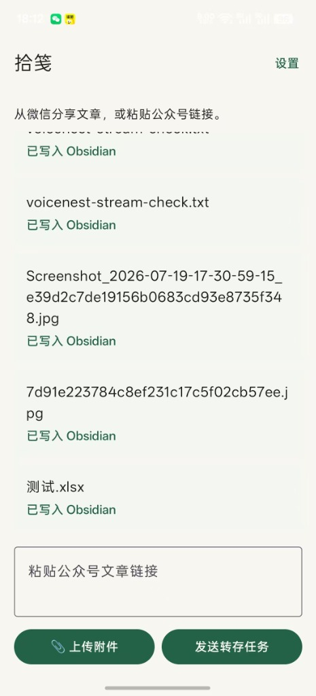
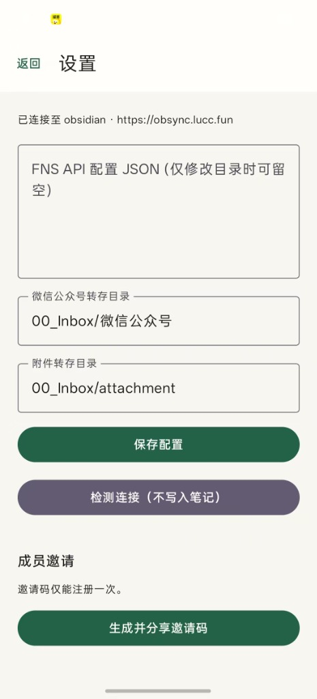

# Shijian · 拾笺

[English](README.md)

> ⚠️ **v0.3.0 破坏性变更**：移除了 Fast Note Sync (FNS) 集成，改用自研 Obsidian 同步插件。老用户需要：1) 卸载 FNS Service（不再需要）；2) 在 Obsidian 中安装新的同步插件。详见 [迁移指南](docs/migration-fns-to-plugin.md)。

拾笺由 Android 客户端与 Python 服务组成，用于将微信公众号文章通过自研 Obsidian 同步插件转存到 Obsidian。本仓库包含 Android 客户端、API、Worker、PocketBase 迁移和本地 H5 调试页。

## Android App

- 应用名：拾笺（Shijian）
- 默认服务：`https://wechat.fun`（或您的自部署地址）
- 自部署：在「设置」中修改服务地址，然后重新登录。
- 输入：在系统分享面板分享公众号链接（文本）、在系统分享面板分享**任何文件/图片**，或粘贴 HTTPS 公众号文章链接 / 在主界面聊天框上传附件。
- 输出：公众号文章转存至**微信公众号目录**，附件（图片、PDF、表格等）转存至 Obsidian 同步插件设置中指定的**附件目录**。两者均保存在用户的 Obsidian 仓库中。
- 状态：任务排队或执行时，首页会自动刷新状态；完成、失败后会停止刷新并显示最终状态。
- 关于：在「设置」可查看当前版本与 GitHub 项目。应用会检查最新 GitHub Release，高亮新版本；下载后校验 SHA-256 与发布签名，最后仍由 Android 系统要求用户确认安装。

### 应用截图
<p align="center">
  
  &nbsp; &nbsp; &nbsp; &nbsp;
  
</p>


## iOS 客户端 (PWA)

为了让 iOS 用户在免购买苹果开发者账号（$99/年）且无侧载签名失效困扰的前提下使用“拾笺”，我们提供了直接托管在您 VPS 域名下的 PWA (Progressive Web App) 移动网页版。

### 安装桌面图标
1. 在 iPhone 的 **Safari 浏览器** 中打开您的“拾笺”后端服务域名（如 `https://wechat.lucc.fun`）。
2. 点击 Safari 底部工具栏的 **分享** 按钮（向上箭头的方框）。
3. 向下滚动并选择 **“添加到主屏幕”**，点击添加。
4. 现在您可以直接从手机桌面启动“拾笺”，体验完全独立的无浏览器边框、全屏的原生 App 级界面。支持在此登录账号、管理双目标目录、测试连接、并直接上传附件。

### iOS 快捷指令（实现系统一键分享转存）
通过 iOS 快捷指令，您可以像 Android 系统的分享一样，在微信、Safari 或其它 App 中点击“分享 ➡️ 更多”一键将网页链接或图片文件自动投递到后端：
1. **指令：公众号 URL 转存**：
   - 新建一个快捷指令，命名为 `拾笺 URL 转存`。在指令详情设置中勾选 **“在共享表单中显示”**，接受类型设为仅 **“链接”**。
   - 添加 **“获取 URL 内容”** 操作：
     - URL 填入：`https://<您的域名>/v1/clips`
     - 方法：`POST`
     - 头部 (Headers)：`Content-Type: application/json` 和 `Authorization: Bearer <您的登录Token>` *(登录 PWA 后，可在浏览器 DevTools LocalStorage 的 `shijian_token` 查到)*
     - 请求体 (Request Body)：选择 `JSON`，键名 `url` 的值设为 **“快捷指令输入”**。
2. **指令：图片与文件附件转存**：
   - 新建一个快捷指令，命名为 `拾笺 附件转存`。勾选 **“在共享表单中显示”**，接受类型设为仅 **“文件”** 和 **“图像”**。
   - 添加 **“获取 URL 内容”** 操作：
     - URL 填入：`https://<您的域名>/v1/clips/files`
     - 方法：`POST`
     - 头部 (Headers)：`Authorization: Bearer <您的登录Token>`
     - 请求体 (Request Body)：选择 `表单` (Form) 格式，键名 `file`，类型选择 `文件`，值设为 **“快捷指令输入”**。


## 邀请码与使用期限管理


- 账户必须通过一次性邀请码注册；邀请码在被使用前不会过期。
- 邀请码首次成功注册后即被消费，注册用户默认获得 30 天使用期限。
- PocketBase 超级管理员可在 `users` 集合修改指定用户的 `access_expires_at`，延长或缩短该用户的使用期限。
- PocketBase 超级管理员可为指定用户开启 `users.can_create_invites`。被授权用户会在 APK「设置 → 成员邀请」看到生成入口，可生成并分享一次性邀请码。
- 不要直接随意新建 `invite_codes` 记录；真实 `code` 与对应 SHA-256 `code_hash` 必须同时正确写入，邀请码才能注册。

## 构建 APK

```bash
JAVA_HOME="/Applications/Android Studio.app/Contents/jbr/Contents/Home" \
ANDROID_SDK_ROOT="$HOME/Library/Android/sdk" \
sh -c 'cd android && ./gradlew :app:testDebugUnitTest :app:assembleDebug'
```

Debug APK 位于 `android/app/build/outputs/apk/debug/app-debug.apk`。

## 构建并发布正式签名包

请只分发正式签名的 APK。keystore 必须放在仓库外，并和密码一起备份；一旦更换发布证书，已安装应用无法原地升级。release 任务要求以下四个环境变量齐全，否则会主动失败：

```bash
export SHIJIAN_RELEASE_STORE_FILE="/safe/path/shijian-release.jks"
export SHIJIAN_RELEASE_STORE_PASSWORD="…"
export SHIJIAN_RELEASE_KEY_ALIAS="shijian-release"
export SHIJIAN_RELEASE_KEY_PASSWORD="…"

JAVA_HOME="/Applications/Android Studio.app/Contents/jbr/Contents/Home" \
ANDROID_SDK_ROOT="$HOME/Library/Android/sdk" \
sh -c 'cd android && ./gradlew :app:testDebugUnitTest :app:assembleRelease'
```

把 `android/app/build/outputs/apk/release/app-release.apk` 上传为 GitHub Release 附件，命名必须是 `Shijian-v<versionName>-<versionCode>-release.apk`，标签必须是 `v<versionName>`。GitHub 会在 Release API 提供附件的 `sha256` 摘要；App 会拒绝没有摘要、资产名称/地址异常、包信息不匹配或签名证书不同的更新。安装绝不会静默执行：用户要先在 App 中确认下载，再在 Android 系统安装页确认安装。

第一版正式签名包不能覆盖 Debug 签名的旧 APK。测试用户需先卸载 Debug APK，再安装正式包并重新登录；之后使用同一 keystore 签名的版本可以正常覆盖升级。

## 本地 H5 PoC

```bash
python3 -m poc.server
```

打开 `http://127.0.0.1:8765`。H5 页面中的 FNS API token 只保留在当前内存中，不会写入浏览器存储。

## 部署

Docker Compose、PocketBase 管理和日常维护说明见 [deploy/README.md](deploy/README.md)。若希望让 AI 代理连接 VPS 完成 Docker 与 Nginx 部署，请使用 [deploy/AI_DEPLOYMENT.md](deploy/AI_DEPLOYMENT.md)。不要提交 `.env`、FNS token 或签名密钥。敏感配置不写入 APK 包内；Obsidian 插件账号密码以明文存于 Vault 的插件 `data.json`。

## Obsidian 同步插件

拾笺从 v0.3.0 起改用自研 Obsidian 插件替代 Fast Note Sync。插件源码位于 [`obsidian-plugin/`](obsidian-plugin/) 目录。

### 构建

```bash
cd obsidian-plugin
npm install
npm run build
```

### 安装

把 `main.js`、`manifest.json` 复制到 Obsidian Vault 的 `.obsidian/plugins/shijian-sync/` 目录，然后在 Obsidian 设置的第三方插件里启用「拾笺同步」。

### 配置

在插件设置页填写：
- 后端服务地址（如 `https://wechat.example.com`）
- 注册时的邮箱和密码
- 文章目录（默认 `公众号收藏`）
- 附件目录（默认 `公众号收藏/assets`）
- 轮询间隔（默认 5 秒）

### 工作原理

Android/iOS 客户端提交文章 URL 到后端 → Worker 抓取公众号文章转 Markdown 落库 → 插件每 5 秒轮询 `/v1/sync/changes` 拉取 → 写入 Vault 并下载图片到本地 → `POST /v1/sync/ack` 确认。

### 隐私

密码以明文保存在 Vault 的 `.obsidian/plugins/shijian-sync/data.json`，请确保设备安全。
